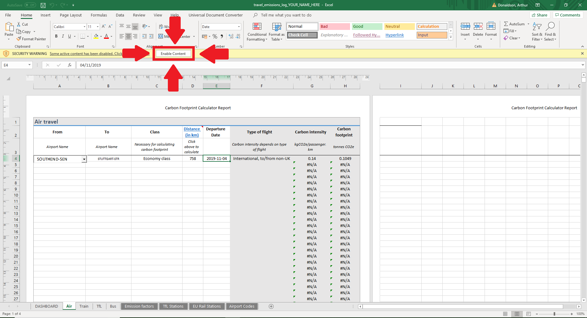

# The Uber Carbon Logger
A simple spreadsheet which calculates and logs the carbon emissions caused by your travel. Designed for use by organizations within London looking to track the carbon footprint of their travel. Developed for use at Imperial College by Artur Donaldson. Thanks also to There Must Be a Better Way / Profs Who Fly. 

# Setting it up
1. Click the button below to download the latest version of the spreadsheet

2. Open up the Excel spreadsheet and enable macros
3. Log emissions following the guide

For easier data input, enable macros. These generate drop down menus on the aviation and trains sheets

# About the data
Uses data from the UK government's 2019 Greenhouse Gas Reporting Figures. You can find the emission factors used in the "Emission Factors" tab at the bottom of the spreadsheet. These are based on the best available data and reports. The data on greenhouse gas emission intensities used at present is sourced at present from the UK government greenhouse gas conversion factors for company reporting.  

# Contributions
Developed by Artur Donaldson, currently work in progress, feel free to suggest changes or make them yourself. Don't forget to publish under the same Open Database license
